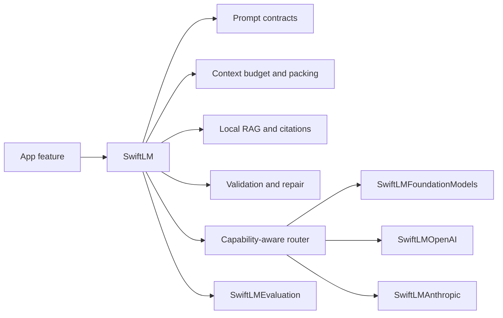
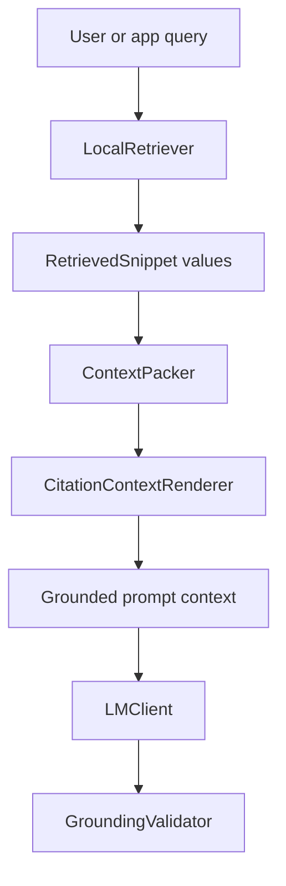
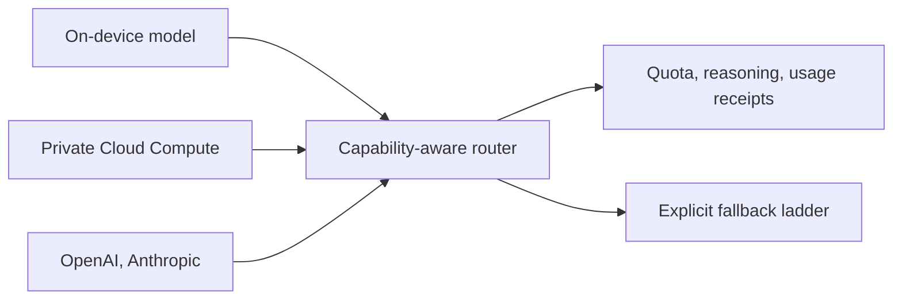

# SwiftLM

[](https://swift.org)
[](#requirements)
[](LICENSE.md)
[](https://github.com/kylebegeman/swift-lm/actions/workflows/ci.yml)

SwiftLM is a Swift-native reliability layer for local-first language model features on Apple platforms. It works with language models of every size: Apple's on-device model, Apple Foundation Models on Private Cloud Compute, and explicitly configured cloud providers.

It helps you build AI features where the hard parts are explicit: prompt contracts, token budgets, context packing, local retrieval, structured generation, validation, fallback, provider routing, and evaluation. The core package has no network access and no telemetry. External providers live in opt-in adapter targets.

## Why It Exists

Apple's Foundation Models framework makes on-device language model features possible with native Swift APIs. Production apps still need the surrounding reliability layer:

- prompts need versioning
- context needs a budget
- long inputs need chunking
- local sources need citations
- structured outputs need validation
- fallbacks need policy
- model behavior needs evaluation
- diagnostics need redaction

SwiftLM keeps those concerns app-neutral so each app does not rebuild the same machinery.

## What Ships

| Product | Use it for |
|---|---|
| `SwiftLM` | Core prompt, context, RAG, validation, workflow, router, metadata, and client primitives |
| `SwiftLMFoundationModels` | Apple Foundation Models availability, token counting, prewarming, typed generation, native tools, and error normalization |
| `SwiftLMOpenAI` | OpenAI Responses API adapter with injectable response and streaming transport |
| `SwiftLMAnthropic` | Anthropic Messages API adapter with injectable response and streaming transport |
| `SwiftLMEvaluation` | Prompt regression, structured output assertions, fallback matrices, and local debug bundles |



## Requirements

- Swift 6.2 or newer
- iOS 26, macOS 26, visionOS 26, or watchOS 26 minimum package targets. On watchOS, the core, OpenAI, Anthropic, and evaluation products work fully, and `FoundationModelClient.live` reports that Foundation Models are unavailable.
- Xcode 26 for the OS 26 SDKs; Xcode 27 (Swift 6.4) to compile the OS 27 paths
- XcodeGen only for the optional showcase app

The OS 27 Foundation Models features (Private Cloud Compute, platform-reported context size, reasoning levels, usage reporting, tool calling modes, and the new error types) are implemented behind `#if compiler(>=6.4)` plus runtime availability checks. The package builds with Xcode 26 and runs on OS 26 devices; the OS 27 paths activate for apps built with Xcode 27 running on OS 27 devices.

## Installation

Add the package with Swift Package Manager:

```swift
dependencies: [
  .package(url: "https://github.com/kylebegeman/swift-lm.git", from: "2.0.0")
]
```

Then add only the products you need:

```swift
.target(
  name: "YourApp",
  dependencies: [
    .product(name: "SwiftLM", package: "swift-lm"),
    .product(name: "SwiftLMFoundationModels", package: "swift-lm")
  ]
)
```

During active development, pin to the `next` branch only when you intentionally want unreleased changes.

## Quick Start

Use the on-device Foundation Models adapter directly:

```swift
import SwiftLM
import SwiftLMFoundationModels

let client = FoundationModelClient.live

guard client.availability().isAvailable else {
  throw LMClientError(reason: .unavailable)
}

let response = try await client.respond(
  to: LMRequest(
    instructions: "Summarize the note in one sentence.",
    messages: [.user(noteText)],
    parameters: .init(maxOutputTokens: 120)
  )
)

print(response.text)
```

Target Apple's server model on Private Cloud Compute (OS 27, entitlement required) with the same adapter:

```swift
let privateCloud = FoundationModelClient.live.targeting(.privateCloudCompute)
let availability = await privateCloud.availability(for: .privateCloudCompute)
let profile = privateCloud.runtimeProfile()

if availability.isAvailable, profile.quotaStatus.permitsGeneration {
  let response = try await privateCloud.respond(
    to: LMRequest(
      instructions: "Analyze the document and list the open questions.",
      messages: [.user(documentText)],
      parameters: .init(maxOutputTokens: 800, reasoningEffort: .medium)
    )
  )
  print(response.text, response.reasoningText ?? "", response.tokenUsage?.reasoningTokens ?? 0)
}
```

Keep a conversation on one session so the model reuses its context:

```swift
let session = try await FoundationModelSession(instructions: "Help plan the trip.")
_ = try await session.respond(to: "What should I pack for Lisbon?")
let followUp = try await session.respond(to: "And for a day trip to Sintra?")
```

Attach images to user messages. Each adapter sends them in its provider's format, and routers skip clients that cannot read them:

```swift
let request = LMRequest(
  messages: [.user("Summarize this receipt.", images: [.data(receiptPNG, mediaType: "image/png")])]
)
```

Route across local and explicitly configured provider-backed clients:

```swift
import SwiftLM
import SwiftLMAnthropic
import SwiftLMFoundationModels
import SwiftLMOpenAI

let local = AnyLMClient(FoundationModelClient.live)
let openAI = AnyLMClient.openAI(apiKey: openAIKey, model: "your-openai-model")
let anthropic = AnyLMClient.anthropic(apiKey: anthropicKey, model: "your-anthropic-model")

let client = LMRouter(
  primary: local,
  fallbacks: [openAI, anthropic]
)

let response = try await client.respond(
  to: LMRequest(
    instructions: "Extract the decision, owner, and due date.",
    messages: [.user(meetingNote)],
    responseFormat: .jsonObject,
    parameters: .init(maxOutputTokens: 400)
  )
)
```

API keys are provided by your app at runtime. SwiftLM does not define a key storage policy and does not persist credentials.

Routing is capability-aware. Current Claude and GPT reasoning models reject `temperature`, so a request with `.deterministic` parameters skips those adapters instead of failing; leave sampling parameters nil for reasoning models and use `reasoningEffort` to control depth. OpenAI responses are not stored server-side unless you opt in.

For larger apps, register already-created clients with `LMEndpointRegistry` and
build routers from endpoint IDs, priorities, enabled state, and routing plans.
The registry stores client handles and routing metadata, not provider secrets.

## Prompt Contracts

Prompt contracts make prompt changes reviewable:

```swift
let contract = PromptContract(
  id: "note-summary",
  version: "2026-06-24",
  instructions: "Summarize only facts present in the input.",
  responseSchemaDescription: "Return one concise paragraph."
)

let prompt = CompiledPrompt(
  contract: contract,
  metadata: client.metadata,
  userPrompt: noteText
)

let response = try await client.respond(to: LMRequest(prompt: prompt))
```

## Context Budgeting

Pack retrieved snippets into an explicit token budget:

```swift
let snippets: [RetrievedSnippet] = [
  RetrievedSnippet(
    id: "policy-1",
    sourceID: "handbook",
    text: "Approvals are required before external provider calls.",
    tokenCount: 12,
    score: 0.98,
    sourceDisplayName: "Engineering Handbook",
    isRequired: true
  )
]

let packer = ContextPacker(
  budget: TokenBudget(
    contextLimit: 4_096,
    reservedResponseTokens: 512,
    safetyMarginTokens: 256
  ),
  strategy: .sourceDiverse
)

let packed = packer.pack(snippets: snippets, reservedInputTokens: 300)
```

Use `LMContextCompiler` when you want the package to assemble the full prompt
plan: instructions, examples, user input, retrieved snippets, schema text, tool
metadata, budget reporting, and dropped-snippet diagnostics.

## Local RAG

SwiftLM includes dependency-free retrieval primitives. Apps can bring their own index, SQLite store, Spotlight search, embeddings, or document pipeline by conforming to `LocalRetriever`.



The built-in `KeywordLocalRetriever` is intentionally simple and deterministic. It is useful for tests, examples, small local corpora, and as a reference implementation.

## Workflows

`LMWorkflow` composes app-owned steps without creating a hidden autonomous agent:

```swift
let workflow = LMWorkflow(detectHints)
  .then(retrieveLocalContext)
  .then(buildPromptPlan)
  .then(generateCandidate)
  .then(validateGrounding)
  .then(repairOrFallback)
```

Workflow results can carry events, intermediate outputs, context budget reports, provider metadata, validation issues, fallback reasons, and source evidence.

## Evaluation

Use `SwiftLMEvaluation` to keep prompt behavior visible as models and prompts change:

```swift
import SwiftLMEvaluation

let evaluationCase = PromptEvaluationCase(
  id: "summary-keeps-owner",
  input: "Maya owns the database migration by Friday.",
  requiredSubstrings: ["Maya", "Friday"],
  forbiddenSubstrings: ["Monday"]
)

let result = PromptEvaluator().evaluate(
  evaluationCase,
  output: response.text
)

precondition(result.passed, result.failures.joined(separator: "\n"))
```

`LMRunReceipt` and `LocalDebugBundle` give apps a redacted way to inspect provider attempts, fallback reasons, duration, and token usage without storing prompt or response text.

## Provider Boundaries

SwiftLM is designed around explicit boundaries:

| Boundary | Package posture |
|---|---|
| Core package | No network access, no telemetry, no provider keys |
| Foundation Models | Isolated to `SwiftLMFoundationModels` |
| OpenAI and Anthropic | Opt-in adapter products |
| API keys | App-owned, runtime-provided, never persisted by SwiftLM |
| Native Apple tools | Typed Foundation Models API only |
| Provider-neutral tools | Request/response shapes only, no hidden local execution |
| Diagnostics | Local and redacted by default |

Native Foundation Models `Tool` values stay on the typed `SwiftLMFoundationModels` API. Provider-neutral requests intentionally reject local tool execution unless an app calls the Foundation-specific wrapper with concrete `[any Tool]` values.

## OS 27 Support

SwiftLM 2.0 adopts the OS 27 Foundation Models framework:

- Private Cloud Compute through `FoundationModelExecutionTarget.privateCloudCompute`, with availability, locale, and quota checks before each request
- platform-reported `contextSize` for on-device and server models
- reasoning levels through `LMGenerationParameters.reasoningEffort`, with reasoning text and reasoning token accounting
- quota status mapped to `FoundationModelQuotaStatus` and `FallbackReason.quotaExceeded`, so a router can fall back to the on-device model when a daily limit is reached
- tool calling modes, usage reporting, and the OS 27 error taxonomy
- native streaming on every supported release
- multi-turn transcripts, and `FoundationModelSession` for conversations that keep their key-value cache and tools
- image attachments for models that accept images
- any `LanguageModel`, such as Core AI, MLX, or a vendor's provider package, through `FoundationModelClient.live(model:executionTarget:contextWindowTokens:)`

Still ahead: transcript compaction, Private Cloud Compute on Apple Watch, and Evaluations framework alignment. Dynamic Profiles stay with Apple's API. See [Roadmap](docs/09-roadmap.md) and [WWDC26 Readiness](docs/14-wwdc26-readiness.md).



## Showcase

The repository includes an XcodeGen iOS showcase shell:

```sh
xcodegen generate --spec Examples/LMShowcase/project.yml
open Examples/LMShowcase/LMShowcase.xcodeproj
```

Generated `.xcodeproj` files are intentionally ignored.

## Verification

```sh
swift build
swift test
swift build -Xswiftc -warnings-as-errors
./scripts/validate.sh
```

`./scripts/validate.sh` also validates the agent manifest, regenerates the showcase project when XcodeGen is installed, and builds the showcase when `xcodebuild` is available.

## Documentation

Start with:

- [Docs Index](docs/README.md)
- [Overview](docs/00-overview.md)
- [Architecture](docs/01-architecture.md)
- [Foundation Models Reference](docs/02-foundation-models-reference.md)
- [Reliability Patterns](docs/03-reliability-patterns.md)
- [Context and Chunking](docs/04-context-and-chunking.md)
- [Structured Generation](docs/05-structured-generation.md)
- [Local RAG](docs/06-local-rag.md)
- [Evaluation and Diagnostics](docs/07-evaluation-and-diagnostics.md)
- [Roadmap](docs/09-roadmap.md)
- [Open Source Readiness](docs/10-open-source-readiness.md)
- [API Stability](docs/11-api-stability.md)
- [Release Process](docs/12-release-process.md)
- [Provider Adapters](docs/13-provider-adapters.md)
- [WWDC26 Readiness](docs/14-wwdc26-readiness.md)
- [2.0.0 Release Notes](docs/16-2.0.0-release-notes.md)

Agents should start at [llm/START_HERE.md](llm/START_HERE.md).

## Contributing

Contributions should keep SwiftLM app-neutral, local-first by default, and explicit about provider boundaries. See [CONTRIBUTING.md](CONTRIBUTING.md).

## License

SwiftLM is released under the [Apache License 2.0](LICENSE.md).
