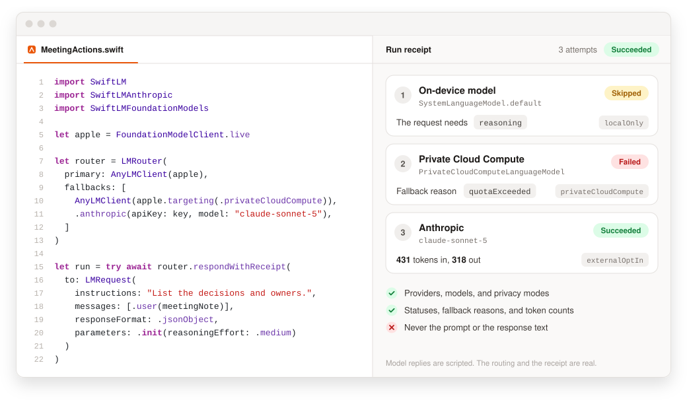
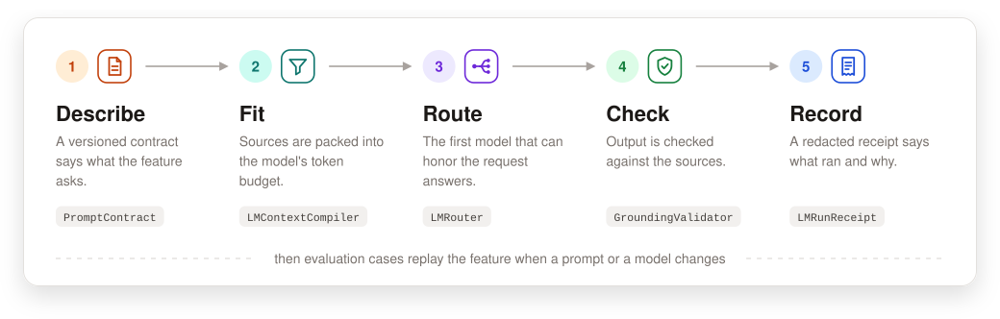
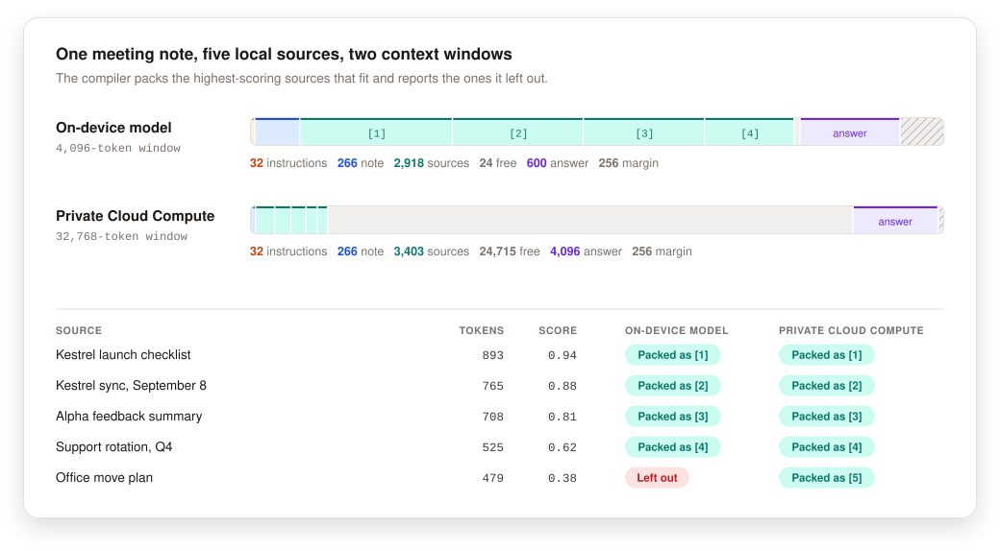
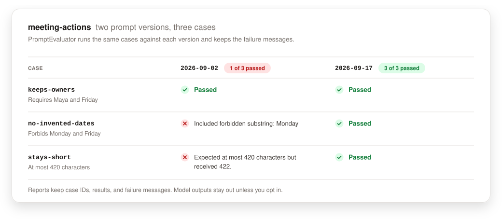

<div align="center">


# SwiftLM

**One Swift API for every language model your app can reach.**

Apple's on-device model, Private Cloud Compute, your own Core AI or MLX model, OpenAI, and Anthropic.<br>
Each one comes with prompt contracts, token budgets, explicit fallbacks, and redacted receipts.

<a href="https://github.com/kylebegeman/swift-lm/actions/workflows/ci.yml?query=branch%3Amaster"></a>
<a href="https://github.com/kylebegeman/swift-lm/tags"></a>


<a href="./LICENSE.md"></a>

[Quick start](#quick-start) · [Route across models](#route-across-models) · [Where it runs](#where-it-runs) · [Fit the context](#fit-the-context) · [Check the output](#check-the-output) · [OS 27](#os-27) · [Docs](#docs)

</div>

<br>

<!-- readme-assets:begin hero-image -->

<picture>
  <source media="(prefers-color-scheme: dark)" srcset="docs/assets/readme/hero-dark.svg">
  
</picture>

<!-- readme-assets:end hero-image -->

## Why SwiftLM

Apple's Foundation Models framework puts a language model on every device with
Apple Intelligence, and OS 27 adds a larger one on Private Cloud Compute. A
feature you ship still needs the parts around the model: a prompt you can
version, a context that fits, a next step when the model can't answer, and a
record of what happened. SwiftLM is that layer, in plain Swift, for every model
your app uses.

<table>
<tr>
<td width="33%" valign="top">

**Local first, cloud by choice**

The on-device model is the default. Private Cloud Compute and cloud providers
run only when you list them, and every client reports where content goes.

</td>
<td width="33%" valign="top">

**Fallbacks with reasons**

Routers skip models that can't honor a request and move on after quota,
context, and availability errors. By default, refusals and bad output stop the
run.

</td>
<td width="33%" valign="top">

**Behavior you can review**

Prompts carry versions, budgets come with reports, and every routed run leaves
a receipt with no prompt or response text in it.

</td>
</tr>
</table>

The core has no network access and no telemetry. Cloud providers live in their
own products, your app hands them API keys at runtime, and SwiftLM stores none
of them.

## How it works

<!-- readme-assets:begin flow-image -->

<picture>
  <source media="(prefers-color-scheme: dark)" srcset="docs/assets/readme/flow-dark.svg">
  
</picture>

<!-- readme-assets:end flow-image -->

Every step is a value you can test on its own. There is no agent loop and no
hidden tool execution. `LMWorkflow` chains the steps into one typed run when
you want events and budget reports for the whole feature.

## Quick start

### Add the package

SwiftLM needs Swift 6.2 and supports iOS, macOS, visionOS, and watchOS 26.
Build with Xcode 27 to compile the [OS 27](#os-27) features.

```swift
dependencies: [
  .package(url: "https://github.com/kylebegeman/swift-lm.git", from: "2.0.0"),
]
```

Then add the products you use:

```swift
.target(
  name: "YourApp",
  dependencies: [
    .product(name: "SwiftLM", package: "swift-lm"),
    .product(name: "SwiftLMFoundationModels", package: "swift-lm"),
  ]
)
```

| Product | Add it for |
| --- | --- |
| `SwiftLM` | The provider-neutral client, router, prompts, context, retrieval, validation, workflows, and receipts |
| `SwiftLMFoundationModels` | Apple's on-device model, Private Cloud Compute, custom `LanguageModel` values, and `FoundationModelSession` |
| `SwiftLMOpenAI` | The OpenAI Responses API |
| `SwiftLMAnthropic` | The Anthropic Messages API |
| `SwiftLMEvaluation` | Prompt evaluation, structured output assertions, fallback matrices, and local debug bundles |

### Ask the on-device model

```swift
import SwiftLM
import SwiftLMFoundationModels

let client = FoundationModelClient.live

guard client.availability().isAvailable else {
  throw LMClientError(reason: .unavailable)
}

let response = try await client.respond(
  to: LMRequest(
    instructions: "Summarize the note in one sentence.",
    messages: [.user(noteText)],
    parameters: .init(maxOutputTokens: 120)
  )
)
print(response.text)
```

### Stream the answer

Every client streams. By default, a router falls back only before the first
output arrives.

```swift
for try await event in client.stream(to: request) {
  switch event {
  case let .textDelta(text):
    print(text, terminator: "")
  case let .completed(response):
    print("\n", response.tokenUsage?.measuredTotalTokens ?? 0)
  default:
    break
  }
}
```

### Reach Private Cloud Compute

Apple's server model needs the OS 27 releases, the managed entitlement, and
daily quota the person hasn't used up. Check before you ask.

```swift
let privateCloud = FoundationModelClient.live.targeting(.privateCloudCompute)
let availability = await privateCloud.availability(for: .privateCloudCompute)
let profile = await privateCloud.reportedRuntimeProfile()

if availability.isAvailable, profile.quotaStatus.permitsGeneration {
  let response = try await privateCloud.respond(
    to: LMRequest(
      instructions: "Analyze the document and list the open questions.",
      messages: [.user(documentText)],
      parameters: .init(maxOutputTokens: 800, reasoningEffort: .medium)
    )
  )
  print(response.text, response.tokenUsage?.reasoningTokens ?? 0)
}
```

### Keep a conversation

`FoundationModelSession` keeps one session across turns, so the model reuses
its context and tools.

```swift
let session = try await FoundationModelSession(instructions: "Help plan the trip.")
_ = try await session.respond(to: "What should I pack for Lisbon?")
let followUp = try await session.respond(to: "And for a day trip to Sintra?")
print(followUp.content)
```

### Send an image

Each adapter sends images in its provider's format, and routers skip clients
that can't read them.

```swift
let image = LMImage.data(receiptPNG, mediaType: "image/png")
let request = LMRequest(messages: [.user("Summarize this receipt.", images: [image])])
let summary = try await client.respond(to: request)
```

### Bring your own model

On OS 27, any Foundation Models `LanguageModel` runs behind the same client:
a Core AI or MLX model, or a vendor's provider package. Pass its context window
when you know it.

```swift
let local = FoundationModelClient.live(
  model: model,
  executionTarget: .customLocal("kestrel-mlx"),
  contextWindowTokens: 8_192
)
let reply = try await local.respond(to: LMRequest(messages: [.user("Draft a reply.")]))
```

## Route across models

`LMRouter` tries its clients in order. It skips a client that can't honor the
request, and it moves on after errors another model might not hit: quota,
context size, rate limits, timeouts, and availability. Refusals, guardrail
violations, decoding failures, and other provider errors end the run.

```swift
import SwiftLM
import SwiftLMAnthropic
import SwiftLMFoundationModels

let apple = FoundationModelClient.live

let router = LMRouter(
  primary: AnyLMClient(apple),
  fallbacks: [
    AnyLMClient(apple.targeting(.privateCloudCompute)),
    .anthropic(apiKey: key, model: "claude-sonnet-5"),
  ]
)

let run = try await router.respondWithReceipt(
  to: LMRequest(
    instructions: "List the decisions and owners.",
    messages: [.user(meetingNote)],
    responseFormat: .jsonObject,
    parameters: .init(reasoningEffort: .medium)
  )
)
```

The image at the top shows this router running offline with scripted model
replies. The on-device model in that run offers no reasoning, so the router
skipped it. Private Cloud Compute reported that the person's daily quota was
used up, so the router moved on, and Claude answered. The receipt records each
attempt and nothing the person wrote.

<details>
<summary><strong>The receipt from that run</strong></summary>

The model replies are scripted, and the run ID, times, and durations are fixed
so the example stays stable. Everything else is what the router recorded.

<!-- readme-assets:begin receipt -->

```json
{
  "attempts" : [
    {
      "completedAt" : "2026-09-17T16:10:00Z",
      "durationMilliseconds" : 0,
      "error" : {
        "errorType" : "SwiftLM.LMClientError",
        "fallbackReason" : "unsupported",
        "providerReason" : "unsupported"
      },
      "id" : "5E0C2D7A-9B41-4F2E-8C6D-3A1B7F904E12-attempt-0",
      "provider" : {
        "modelIdentifier" : "SystemLanguageModel.default",
        "privacyMode" : "localOnly",
        "promptVersion" : "foundation-models-v1",
        "providerDisplayName" : "Apple Foundation Models",
        "providerKind" : "appleFoundationModels"
      },
      "startedAt" : "2026-09-17T16:10:00Z",
      "status" : "skippedUnsupportedCapabilities",
      "unsupportedCapabilities" : [
        "reasoning"
      ]
    },
    {
      "completedAt" : "2026-09-17T16:10:00Z",
      "durationMilliseconds" : 184,
      "error" : {
        "errorType" : "SwiftLMFoundationModels.FoundationModelFailure",
        "fallbackReason" : "quotaExceeded"
      },
      "id" : "5E0C2D7A-9B41-4F2E-8C6D-3A1B7F904E12-attempt-1",
      "provider" : {
        "modelIdentifier" : "PrivateCloudComputeLanguageModel",
        "privacyMode" : "privateCloudCompute",
        "promptVersion" : "foundation-models-v1",
        "providerDisplayName" : "Apple Foundation Models",
        "providerKind" : "appleFoundationModels"
      },
      "startedAt" : "2026-09-17T16:10:00Z",
      "status" : "failed",
      "unsupportedCapabilities" : [

      ]
    },
    {
      "completedAt" : "2026-09-17T16:10:02Z",
      "durationMilliseconds" : 2760,
      "id" : "5E0C2D7A-9B41-4F2E-8C6D-3A1B7F904E12-attempt-2",
      "provider" : {
        "modelIdentifier" : "claude-sonnet-5",
        "privacyMode" : "externalOptIn",
        "promptVersion" : "anthropic-messages-v1",
        "providerDisplayName" : "Anthropic",
        "providerKind" : "anthropic"
      },
      "startedAt" : "2026-09-17T16:10:00Z",
      "status" : "succeeded",
      "tokenUsage" : {
        "estimatedInputTokens" : 431,
        "estimatedOutputTokens" : 318,
        "measuredInputTokens" : 431,
        "measuredOutputTokens" : 318
      },
      "unsupportedCapabilities" : [

      ]
    }
  ],
  "completedAt" : "2026-09-17T16:10:02Z",
  "finalProvider" : {
    "modelIdentifier" : "claude-sonnet-5",
    "privacyMode" : "externalOptIn",
    "promptVersion" : "anthropic-messages-v1",
    "providerDisplayName" : "Anthropic",
    "providerKind" : "anthropic"
  },
  "id" : "5E0C2D7A-9B41-4F2E-8C6D-3A1B7F904E12",
  "outcome" : "succeeded",
  "request" : {
    "contextItemCount" : 0,
    "messageCount" : 1,
    "requiredCapabilities" : [
      "instructions",
      "jsonObjectResponse",
      "reasoning"
    ],
    "responseFormat" : "jsonObject",
    "toolCount" : 0,
    "toolResultCount" : 0
  },
  "startedAt" : "2026-09-17T16:10:00Z",
  "tokenUsage" : {
    "estimatedInputTokens" : 431,
    "estimatedOutputTokens" : 318,
    "measuredInputTokens" : 431,
    "measuredOutputTokens" : 318
  }
}
```

<!-- readme-assets:end receipt -->

</details>

Larger apps register endpoints once and build routers from priorities and
settings. The registry holds clients and routing metadata and persists nothing.

```swift
var registry = LMEndpointRegistry()
registry.register(
  LMEndpoint(id: "on-device", client: AnyLMClient(FoundationModelClient.live))
)
registry.register(
  LMEndpoint(
    id: "claude",
    client: .anthropic(apiKey: key, model: "claude-sonnet-5"),
    priority: 10,
    isEnabled: userAllowsCloud
  )
)

let router = try registry.router()
```

## Where it runs

Every client describes what it can do. This table comes from the adapters' own
capability values, and routers read the same values to skip clients that
can't honor a request.

<!-- readme-assets:begin capabilities -->

| Client | Product | Privacy mode | Context window | Needs |
| --- | --- | --- | --- | --- |
| **On device** | `SwiftLMFoundationModels` | `localOnly` | Reported by the OS | Apple Intelligence on a supported device |
| **Private Cloud Compute** | `SwiftLMFoundationModels` | `privateCloudCompute` | Reported by the OS | OS 27, the entitlement, and daily quota |
| **Your model** | `SwiftLMFoundationModels` | `localOnly`, or `externalOptIn` for a provider package | The value you pass | OS 27 and a `LanguageModel` |
| **OpenAI** | `SwiftLMOpenAI` | `externalOptIn` | Not reported | An API key from your app |
| **Anthropic** | `SwiftLMAnthropic` | `externalOptIn` | Not reported | An API key from your app |

| | On device | Private Cloud Compute | Your model | OpenAI | Anthropic |
| --- | :-: | :-: | :-: | :-: | :-: |
| **Streaming** | Yes | Yes | Yes | Yes | Yes |
| **JSON output** | Yes | Yes | Yes | Yes | Yes |
| **Enforced JSON schema** | No | No | No | Yes | Yes |
| **Reasoning effort** | Per model | Yes | Per model | Yes | Yes |
| **Image input** | Per model | Per model | Per model | Yes | Yes |
| **Tool calls** | Typed API | Typed API | Typed API | Yes | Yes |
| **Temperature** | Yes | Yes | Yes | Per model | Per model |
| **Stop sequences** | No | No | No | No | Yes |
| **Prewarming** | Yes | Yes | Yes | No | No |

<!-- readme-assets:end capabilities -->

- **Per model means the model decides.** On OS 27, Foundation Models clients
  read reasoning and image support from the model at runtime. The OpenAI and
  Anthropic adapters drop `temperature` for reasoning models, so leave it unset
  and use `reasoningEffort`.
- **OpenAI stores nothing by default.** Responses stay off OpenAI's servers
  unless you opt in with `storesResponses`.
- **Foundation Models tools use the typed API.** Pass native `Tool` values to
  `FoundationModelSession` or to the typed client calls. Provider-neutral
  requests with tools skip those clients.

## Fit the context

<!-- readme-assets:begin budget-image -->

<picture>
  <source media="(prefers-color-scheme: dark)" srcset="docs/assets/readme/budget-dark.svg">
  
</picture>

<!-- readme-assets:end budget-image -->

Retrieval is local and has no dependencies. `KeywordLocalRetriever` is a small
reference implementation. Conform your own index, SQLite store, or Spotlight
search to `LocalRetriever`.

```swift
let documents = notes.map { note in
  RetrievableDocument(id: note.id, text: note.body, displayName: note.title)
}
let retriever = KeywordLocalRetriever(documents: documents)
let rag = LocalRAGPipeline(
  retriever: retriever,
  packer: ContextPacker(budget: TokenBudget(), strategy: .sourceDiverse)
)

let found = try await rag.run(query: LocalRetrievalQuery(text: "launch blockers"))
print(found.contextBlock, found.citations.map(\.marker))
```

`LMContextCompiler` turns a contract, the person's input, and retrieved
snippets into a prompt that fits the model's window. It reports the budget and
every snippet it left out. The image above is this compiler, run once for each
window with the same five sources.

```swift
let contract = PromptContract(
  id: "meeting-actions",
  version: "2026-09-17",
  instructions: "List each decision and action item. Use only facts from the note.",
  responseSchemaDescription: "JSON: decisions, and actions with an owner and a due date."
)

let budget = TokenBudget(
  contextLimit: client.capabilities.contextWindowTokens ?? 4_096,
  reservedResponseTokens: 600
)

let compiled = LMContextCompiler(budget: budget).compile(
  LMContextCompilationInput(
    contract: contract,
    metadata: client.metadata,
    userPrompt: note,
    retrievedSnippets: found.packedSnippets
  )
)

print(compiled.budgetReport.remainingInputTokens, compiled.droppedSnippets.map(\.id))
let response = try await client.respond(to: LMRequest(prompt: compiled.compiledPrompt))
```

For inputs longer than one window, `BoundaryAwareTextChunker`,
`TranscriptChunker`, and `MapReducePipeline` split the work into chunks that
each fit, then merge the results in order.

## Check the output

`StructuredGenerationPipeline` validates each candidate, checks the evidence it
cites against the sources, and repairs or falls back by policy.

```swift
struct MeetingActions: Codable, Sendable {
  var summary: String
  var owners: [String]
}

let pipeline = StructuredGenerationPipeline<MeetingActions>(
  generate: { prompt in
    let request = LMRequest(prompt: prompt, responseFormat: .jsonObject)
    let response = try await client.respond(to: request)
    let data = Data(response.text.utf8)
    let output = try JSONDecoder().decode(MeetingActions.self, from: data)
    return GenerationCandidate(output: output, metadata: response.metadata)
  },
  validator: .all([
    .nonEmptyString(\.summary, path: "summary"),
    .maximumCount(\.owners, maximum: 8, path: "owners"),
    .groundedEvidence(),
  ]),
  repairPolicy: .fallbackOnValidationFailure(),
  fallbackPolicy: .fixed(MeetingActions(summary: "", owners: []))
)

let result = try await pipeline.run(
  prompt: compiled.compiledPrompt,
  context: StructuredGenerationSourceContext(sourceText: note),
  evidence: { [EvidenceSpan(id: "summary", text: $0.summary, sourceID: "source")] }
)
print(result.status, result.validation.issues.map(\.message))
```

## Catch regressions

<!-- readme-assets:begin evaluation-image -->

<picture>
  <source media="(prefers-color-scheme: dark)" srcset="docs/assets/readme/evaluation-dark.svg">
  
</picture>

<!-- readme-assets:end evaluation-image -->

`SwiftLMEvaluation` replays the same cases whenever a prompt or a model
changes. Reports keep case IDs, results, and failure messages, and leave model
output out unless you ask for it.

```swift
import SwiftLMEvaluation

let cases = [
  PromptEvaluationCase(
    id: "keeps-owners",
    input: "Maya owns the release checklist and will circulate it by Friday.",
    requiredSubstrings: ["Maya", "Friday"]
  ),
  PromptEvaluationCase(
    id: "no-invented-dates",
    input: "Luis will finish the sync conflict fix soon.",
    forbiddenSubstrings: ["Monday", "Friday"]
  ),
]

let evaluator = PromptEvaluator()
var results: [PromptEvaluationResult] = []
for evaluationCase in cases {
  let prompt = CompiledPrompt(
    contract: contract,
    metadata: client.metadata,
    userPrompt: evaluationCase.input
  )
  let response = try await client.respond(to: LMRequest(prompt: prompt))
  results.append(evaluator.evaluate(evaluationCase, output: response.text))
}

let report = PromptVersionEvaluationReport(prompt: contract, results: results)
try report.jsonData().write(to: reportURL)
```

`LocalDebugBundle` packs prompt reports, a fallback matrix, and run receipts
into one local file for debugging. Bundles are redacted unless you choose
otherwise.

## OS 27

SwiftLM builds with Xcode 26 and runs on the OS 26 releases. Build with Xcode 27
to compile the OS 27 Foundation Models features. Each one also checks
availability at runtime, so the same app still runs on OS 26.

| Feature | In SwiftLM |
| --- | --- |
| Private Cloud Compute | The `.privateCloudCompute` target, with availability, locale, and quota checks |
| Context size | The window each model reports, on device and on the server |
| Reasoning | `reasoningEffort` maps to reasoning levels, and responses carry reasoning text and token counts |
| Quota | `FoundationModelQuotaStatus`, and `quotaExceeded` so routers fall back |
| Usage | Measured input, output, cached, and reasoning tokens |
| Tool calling modes | `FoundationModelToolCallingMode` |
| Errors | The OS 27 error types, mapped to fallback reasons |
| Images | Attachments for models with the vision capability |
| Custom models | Any `LanguageModel` through `FoundationModelClient.live(model:executionTarget:contextWindowTokens:)` |

On watchOS, the core, cloud, and evaluation products work in full, and the
Foundation Models client reports that the framework is unavailable. Transcript
compaction, Private Cloud Compute on Apple Watch, and Evaluations framework
alignment are still ahead. See the [roadmap](docs/09-roadmap.md) and
[WWDC26 readiness](docs/14-wwdc26-readiness.md).

## Showcase app

[`Examples/LMShowcase`](Examples/LMShowcase) is an iOS app with panels for
model availability, Private Cloud Compute readiness, provider routing, token
budgets, chunking, local retrieval, and evaluation. XcodeGen generates the
project, which is not committed.

```bash
xcodegen generate --spec Examples/LMShowcase/project.yml
open Examples/LMShowcase/LMShowcase.xcodeproj
```

## Docs

| Doc | Read it for |
| --- | --- |
| [Overview](docs/00-overview.md) | What SwiftLM is for and what it leaves out |
| [Architecture](docs/01-architecture.md) | Targets, products, and ownership rules |
| [Foundation Models reference](docs/02-foundation-models-reference.md) | Platform constraints and how they shape the package |
| [Reliability patterns](docs/03-reliability-patterns.md) | Techniques that make small on-device models dependable |
| [Context and chunking](docs/04-context-and-chunking.md) | Budgets, packing, and long inputs |
| [Structured generation](docs/05-structured-generation.md) | Schemas, validation, grounding, and repair |
| [Local RAG](docs/06-local-rag.md) | Offline retrieval and citations |
| [Evaluation and diagnostics](docs/07-evaluation-and-diagnostics.md) | Prompt regression, receipts, and debug bundles |
| [Provider adapters](docs/13-provider-adapters.md) | The client API and each adapter's behavior |
| [WWDC26 readiness](docs/14-wwdc26-readiness.md) | The OS 27 Foundation Models work, shipped and planned |
| [API stability](docs/11-api-stability.md) | Versioning and the public API policy |
| [2.0.0 release notes](docs/16-2.0.0-release-notes.md) | The rename, OS 27 support, and fixes |
| [Roadmap](docs/09-roadmap.md) | What comes next |
| [Security](SECURITY.md) | Reporting a vulnerability |

Coding agents start at [llm/START_HERE.md](llm/START_HERE.md).

## Development

```bash
./scripts/validate.sh
```

The script builds the package, runs the tests, checks the agent manifest and
the README assets, and builds the showcase when Xcode is selected. CI runs it
on Xcode 26 and on GitHub's Xcode 27 image, together with a strict build and
builds for iOS, visionOS, and watchOS.

The images and generated tables in this README come from real SwiftLM output,
and every Swift block above is compiled. Regenerate them after a change that
affects them:

```bash
swift run --package-path scripts/readme-assets ReadmeAssets
```

See [scripts/readme-assets](scripts/readme-assets) for how that works, and
[CONTRIBUTING.md](CONTRIBUTING.md) before opening a pull request.

## License

[Apache License 2.0](LICENSE.md)
